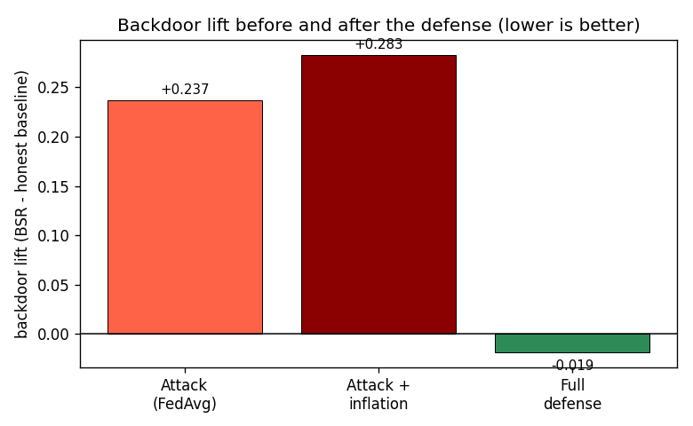

# Week 9 Progress: Core Results Summary

**Group 1.** This is the short written summary for the Week 9 assignment. The main table, the main figure, and the sensitivity table below are the core evidence for the paper: the attack works, the defense removes the backdoor effect, and clean accuracy is preserved. All numbers were produced by `09_final_iteration.ipynb` (seed 42).

## Setup

Federated GPS-spoofing detection. 10 clients, 2 compromised (C9 and C10, a 20% compromise rate), IID split, 150,000-row sample (60% authentic, 40% spoofed), 12 FL rounds, 3 local epochs, batch 512. Attack: 40% poison rate, CN0 trigger at the benign 75th percentile, model-replacement scaling factor 3, and a fake reported accuracy of 0.99 in the inflation case. Defense: server-side behavioral trust (beta 2.0, trust smoothing 0.5, 6,000-row clean root set) plus coordinate-wise median. Note: the assignment template refers to a single "Client 5"; our design uses two attacker clients, so we report the trust of both (C9, C10).

## Main result table

| Case | Clean Acc | Spoof Recall | BSR | Backdoor Lift | Attacker Trust/Weight |
|---|---|---|---|---|---|
| Honest FedAvg | 0.7138 | 0.5447 | 0.6600 | 0.0000 | n/a (no attacker) |
| Attack (FedAvg) | 0.6990 | 0.3977 | 0.8966 | +0.2366 | 0.100 (uniform) |
| Attack + inflation (Acc-Weighted) | 0.6941 | 0.3758 | 0.9429 | +0.2829 | inflated above 0.100 (fake 0.99) |
| Median-only (ablation) | 0.7135 | 0.5152 | 0.7154 | +0.0554 | n/a (no weighting) |
| **Full defense** | **0.7095** | **0.5387** | **0.6412** | **-0.0188** | **0.000 (suppressed)** |

BSR is the backdoor success rate (fraction of trigger-bearing spoofed rows called benign; lower is better). Backdoor lift is BSR minus the honest baseline (0.6600), so it isolates the extra harm from the attacker. **What it shows:** the attack raises lift to +0.24, and accuracy inflation raises it to +0.28 by handing the attackers extra aggregation weight; the full defense drives lift back to about zero while clean accuracy stays near 0.71 and spoofing recall is restored. The attacker trust column shows the two compromised clients going from uniform (or inflated) weight down to zero under the defense.

## Main figure

**Caption.** Backdoor lift for the two attack cases and the full defense. The attack adds a large positive lift, accuracy inflation adds more, and the defense removes it, driving the lift to approximately zero. This is the core paper claim.

Supporting figures (in `results/`): attacker trust across rounds (`support_trust_rounds.png`, which shows the defense identifying the two compromised clients) and BSR by experiment (`support_bsr_by_experiment.png`).

## Sensitivity check (poison ratio)

| Poison Ratio | Clean Acc | Spoof Recall | BSR | Backdoor Lift |
|---|---|---|---|---|
| 30% | 0.7092 | 0.5357 | 0.6419 | -0.0181 |
| 40% | 0.7095 | 0.5387 | 0.6412 | -0.0188 |
| 50% | 0.7095 | 0.5373 | 0.6407 | -0.0193 |

The defended backdoor lift stays flat and near zero from 30% to 50% poisoning, so the result does not depend on one particular poison rate.

## Summary

- **Experiments completed:** honest FedAvg baseline, attack under FedAvg, attack under accuracy-weighted aggregation with inflation, a median-only ablation, the full defense, and a poison-ratio sensitivity check.
- **Did the defense reduce BSR / backdoor lift?** Yes. Lift dropped from +0.24 (attack) and +0.28 (attack plus inflation) to about zero under the full defense. The attacker gains no advantage over an honest model.
- **Did clean accuracy stay reasonable?** Yes. Clean accuracy under the defense (0.7095) matches the honest baseline (0.7138) within noise, and spoofing recall recovered from 0.3977 (attacked) to 0.5387.
- **What remains unfinished:** the base detector is only moderately strong on this simplified dataset (spoofing recall about 0.54 with no trigger), which is why lift is the primary metric. We have not tested an adaptive attacker that specifically evades the trust probe. Non-IID client data and a larger fleet are left for later.

## Background-reading notes (no separate deliverable)

- **Computational overhead:** the model is about 3,300 parameters (roughly 13 KB per update), and the defense runs entirely on the server, adding only tens of milliseconds per round (a small fraction of round time; local training dominates). A full measured breakdown lives in the week 8 cost-analysis folder.
- **False-positive reporting:** for this trust-based defense, no honest client is ever fully excluded (only the attackers reach zero trust), though one honest client is persistently down-weighted, which we disclose; the detector false-alarm rate stays at the honest baseline level. A fuller discussion lives in the week 8 final folder.
